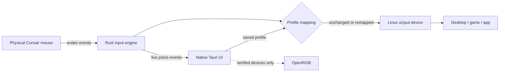

<div align="center">
  

  # Corsair Control for Linux

  **Your mouse. Your shortcuts. Your Linux box.**

  A native, chromeless control room for the Corsair Ironclaw—and a growing collection of other Corsair input devices.
</div>

---

Corsair makes a very comfortable mouse. Linux makes a very comfortable operating system. The two just needed someone to introduce them properly.

Corsair Control is a Rust-powered desktop app for remapping mouse buttons, recording shortcuts, managing profiles, inspecting connection modes, and—where the hardware protocol is known—controlling RGB. It runs as a proper borderless Linux application using Tauri and WebKitGTK. No browser tab, no mystery localhost server, no Windows VM lurking under the desk.

The app was built around a real **Corsair Ironclaw Wireless SE**, currently identifying itself as `1b1c:2b32`.

## The good bits

| Feature | Status | What it does |
|---|:---:|---|
| Button remapping | ✅ | Pass through, disable, send a key, media control, shortcut, profile action, or DPI-stage action |
| Shortcut recording | ✅ | Press a combination such as `Ctrl` + `Alt` + `T`; the app stores and replays it safely |
| Input learning | ✅ | Press an unknown physical button and teach the profile its Linux event code |
| Live button feedback | ✅ | Physical presses travel directly from Rust to the mouse diagram and glow orange while held |
| Wireless SE extra buttons | ✅ | Switches `2b32` into software-control mode and reads F, B, O, profile, and DPI controls from its extended HID channel |
| Profiles | ✅ | Keep separate layouts for desktop work, games, editing, or that one app with 47 shortcuts |
| USB + Bluetooth discovery | ✅ | Finds Corsair HID devices and reports their current transport |
| Slipstream discovery | ✅ | Recognizes verified receiver IDs when the dongle is present |
| Tray/panel mode | ✅ | Close the window without stopping mappings; restore it from the custom tray icon |
| RGB effect editor | ✅ | Preview static, gradient, breathing, spectrum, wave, reactive, and off patterns across the three real lighting zones |
| Hardware RGB apply | 🟢 | Uses OpenRGB when it exposes the connected mouse as an Ironclaw controller |
| RGB and onboard DPI on `2b32` | 🔒 | Hardware writes stay locked until OpenRGB or a verified Wireless SE protocol exposes this revision |

## Meet the control room

The interface is split into four stations:

- **Assignments** — click a control on the mouse diagram, identify its physical event, then give it a better job.
- **Lighting** — design and save three-zone color profiles, preview seven animated effects, then apply them when a verified RGB backend is available.
- **Performance** — organize up to six DPI-stage markers and polling-rate preferences per profile.
- **Connections** — see whether the mouse arrived over USB, Slipstream 2.4 GHz, or Bluetooth.

Mint means “selected for editing.” Orange means “the physical button is being pressed right now.” If an unusual firmware sends an unfamiliar code, the raw event appears on the mouse map so it cannot hide forever.

## A tiny driver tour



The input engine grabs the Corsair event nodes, processes only the configured controls, and relays everything through a virtual Linux input device. Unassigned events pass through unchanged. If the application exits, the kernel releases the grabs automatically—your mouse does not become a stylish paperweight.

Button mappings stay active while the process is running. Closing the window hides it to the tray; choosing **Quit** from the tray actually stops it.

## Install it

### 1. Install build dependencies

On Ubuntu 24.04, Linux Mint, and related Debian-based systems:

```bash
sudo apt install build-essential curl file \
  libwebkit2gtk-4.1-dev libgtk-3-dev \
  libayatana-appindicator3-dev librsvg2-dev
```

You will also want OpenRGB if you have one of the verified original Ironclaw revisions:

```bash
sudo apt install openrgb
```

### 2. Build and install

```bash
chmod +x scripts/install.sh scripts/uninstall.sh
./scripts/install.sh
```

The installer builds an optimized Rust binary and adds:

- the application at `/usr/local/bin/corsair-control`;
- Linux input permissions at `/etc/udev/rules.d/70-corsair-control.rules`;
- an application-menu entry;
- crisp versions of the custom icon from 16×16 through 256×256.

Reconnect the mouse once after installation, then open **Corsair Control** from your application menu.

Prefer to look around before installing anything system-wide? Run it from the repository:

```bash
cargo run
```

The interface will open, although the input engine may request permissions until the udev rule is installed.

## Your first remap in 30 seconds

1. Open **Assignments**.
2. Pick a button on the Ironclaw diagram.
3. For an unknown extra button, choose **Identify Input** and press it once.
4. Select an action—or hit **Record** and type a shortcut.
5. Choose **Save to Profile**.
6. Press the physical button and enjoy the orange glow of immediate gratification.

Profiles are written atomically to:

```text
${XDG_CONFIG_HOME:-~/.config}/corsair-control/config.json
```

No arbitrary shell commands are executed by button mappings. That feature was left out on purpose; a mouse button should open your terminal because you mapped a shortcut, not because it quietly became root.

## The tray icon has one job (well, two)

Closing the main window hides it and leaves the Rust input engine running.

- **Open Corsair Control** restores and focuses the window.
- **Quit** releases the input devices and stops the application.

The same mint-and-orange mouse icon is used in the system tray, taskbar, and desktop application menu, with dedicated sizes so it stays sharp instead of becoming a tiny turquoise smudge.

## About the `2b32`-shaped elephant in the room

The Ironclaw Wireless SE connected during development reports:

```text
Vendor:  1b1c
Product: 2b32
Name:    CORSAIR IRONCLAW WIRELESS SE Gaming Mouse
```

That product ID is newer than the Ironclaw definitions currently used by ckb-next and OpenRGB. Corsair's vendor protocol is not interchangeable across every firmware revision, so this project refuses to send packets copied from an older mouse and simply hope for the best.

For `2b32`, today:

- Linux input, all seven extra controls, remapping, shortcuts, live button feedback, and profiles work. The driver restores hardware mode when it exits.
- RGB hardware writes, physical sensor DPI, polling-rate writes, firmware operations, and receiver pairing remain capability-locked.
- The UI lets you design, animate, and save static, gradient, breathing, spectrum, wave, reactive, and off lighting profiles for the logo, wheel, and front grille.
- **Apply to Device** unlocks automatically when OpenRGB identifies a compatible Ironclaw controller; previews and saved profiles never depend on hardware support.

Bluetooth generally exposes standard HID input but may not expose Corsair's configuration channel. Slipstream capabilities depend on the receiver PID and firmware. Switch transports, open **Connections**, and hit **Rescan**.

This caution is intentional. “Did not brick the mouse” is an underrated feature.

## Project map

```text
src/
├── input.rs       evdev capture, uinput relay, shortcuts, live press events
├── main.rs        Tauri commands, window behavior, tray menu
├── model.rs       device discovery, profiles, validation, persistence
└── rgb.rs         guarded OpenRGB adapter

ui/
├── index.html     control-room structure and mouse diagram
├── styles.css     industrial interface styling
├── mouse-diagram.css detailed Ironclaw Wireless SE illustration and full-height profile map
├── lighting-effects.css three-zone preview and animated RGB patterns
├── action-editor.css context-sensitive action controls and shortcut recorder
├── hotspots.css   physical button and title-bar interaction states
└── app.js         profile editor and Rust ↔ UI bridge

resources/         udev rules and desktop launcher
icons/             source SVG and Linux icon sizes
scripts/           installer and uninstaller
```

## Development

The project intentionally keeps the dependency list small: Rust, Tauri, Serde, and direct Linux system calls. The webview frontend is plain HTML, CSS, and JavaScript, so there is no separate Node build pipeline waiting to download half the internet.

Run the checks:

```bash
cargo test --offline
cargo clippy --offline --all-targets -- -D warnings
node --check ui/app.js
bash -n scripts/install.sh scripts/uninstall.sh
```

Build the optimized binary:

```bash
cargo build --release --locked
```

Protocol work for `1b1c:2b32`, additional Corsair devices, event-code reports, and tasteful icon improvements are all welcome.

## Uninstall

```bash
./scripts/uninstall.sh
```

The uninstaller removes the binary, udev rule, desktop entry, and installed icons. Your profiles are left in `~/.config/corsair-control` so a future reinstall remembers which button launches your calculator.

## License

Corsair Control is available under **GPL-3.0-or-later**.

The OpenRGB adapter invokes OpenRGB as a separate installed application; no OpenRGB protocol source is copied into this repository.
